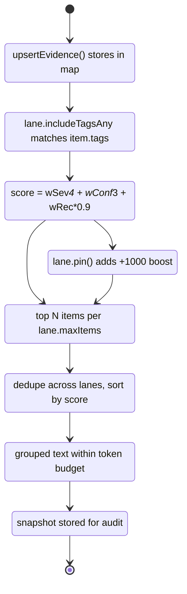
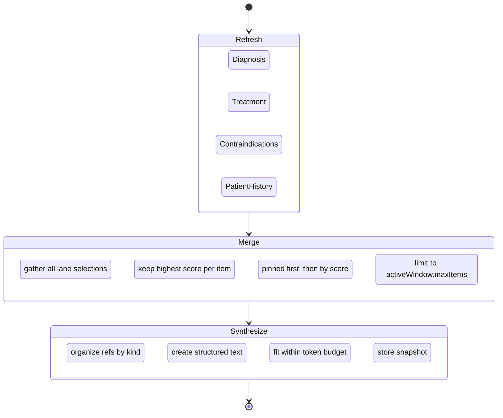

[](https://github.com/williamseemueller/active-meta-mgt/actions/workflows/test.yml)
[](https://opensource.org/licenses/MIT)

# Active Meta-Context Management (Framework)

Theoretical active context management system with context "lanes"; generic enough for broad applications across complex domains.

> The examples were generated with the intent to bruteforce accuracy via high-stakes scenarios. This is not medical software.

## Overview

This framework provides a structured approach to managing contextual information for LLM-based clinical applications. It enables:

- **Multi-lane context organization** - Separate knowledge into clinical domains (diagnosis, treatment, patient-history, regulatory, contraindications, etc.)
- **Token-aware synthesis** - Generate condensed working memory within token budgets for efficient LLM prompting
- **Scoring-based selection** - Prioritize clinical findings by severity, confidence, priority, recency, and pinned status
- **Full audit trail** - Archive selections with complete snapshots for compliance and clinical review

## Installation

```bash
npm install active-meta-mgt
# or
bun add active-meta-mgt
# or
yarn add active-meta-mgt
```

## Quick Start

```typescript
import { makeDefaultActiveMetaContext } from "active-meta-mgt";

// 1. Create a context for a patient encounter
const ctx = makeDefaultActiveMetaContext("encounter-12345");

// 2. Add clinical knowledge objects with lane tags
ctx.upsertGoal({
  id: "goal-1",
  title: "Achieve glycemic control (HbA1c < 7%)",
  tags: [{ key: "lane", value: "treatment" }],
  priority: "p0"
});

ctx.upsertEvidence({
  id: "lab-1",
  summary: "HbA1c: 9.2% (critical high)",
  detail: "Collected 2024-01-15, fasting specimen",
  tags: [{ key: "lane", value: "diagnosis" }],
  severity: "critical",
  confidence: "high"
});

ctx.upsertConstraint({
  id: "con-1",
  statement: "Patient has documented sulfa allergy - avoid sulfonylureas",
  tags: [{ key: "lane", value: "contraindications" }],
  priority: "p0"
});

ctx.upsertEvidence({
  id: "hx-1",
  summary: "History of metformin intolerance (GI side effects)",
  tags: [{ key: "lane", value: "patient-history" }],
  severity: "medium",
  confidence: "high"
});

// 3. Synthesize working memory from all lanes
ctx.synthesizeFromLanes({
  tokenBudget: 600,
  archiveRawItems: false
});

// 4. Get the LLM-ready payload for clinical decision support
const payload = ctx.buildLLMContextPayload();
console.log(payload.workingMemory.text);
```

## Core Concepts

### Knowledge Objects

Six types of clinical entities stored globally:

| Type | Clinical Use | Key Fields |
|------|--------------|------------|
| **Goal** | Treatment objectives, care plan targets | `title`, `priority` (p0-p3), `status` |
| **Constraint** | Contraindications, allergies, protocol limits | `statement`, `priority`, `status` |
| **Assumption** | Clinical hypotheses, working diagnoses | `statement`, `confidence` (low/medium/high), `status` |
| **Evidence** | Lab results, imaging findings, vital signs | `summary`, `detail`, `severity`, `confidence` |
| **OpenQuestion** | Pending workup, diagnostic uncertainties | `question`, `priority`, `status` |
| **Decision** | Treatment choices, clinical judgments | `statement`, `rationale`, `status` |

All objects support:
- `tags` - Array of key/value pairs for lane filtering (e.g., `{key: "lane", value: "diagnosis"}`)
- `provenance` - Source tracking (user, system, tool, doc, web, inference)
- `createdAt` / `updatedAt` - Timestamps for recency scoring

### Context Lanes

Lanes are separate clinical domains that filter and score items independently:

```typescript
// Example clinical lanes:
// - diagnosis (maxItems: 20) - Active differentials, confirmed diagnoses
// - treatment (maxItems: 20) - Treatment goals, medication plans
// - patient-history (maxItems: 15) - Relevant PMH, social history
// - contraindications (maxItems: 10) - Allergies, drug interactions
// - regulatory (maxItems: 10) - HIPAA, consent, protocol requirements

// Create custom lane for a specialty
ctx.ensureLane("cardiology", "Cardiology Consult");
const lane = ctx.lanes.get("cardiology");
lane.setIncludeTagsAny([{ key: "lane", value: "cardiology" }]);
lane.setWindowPolicy({ maxItems: 15, wSeverity: 2.0 }); // Prioritize severity
```

Lane states:
- `enabled` - Participates in selection and merge
- `muted` - Exists but excluded from current synthesis
- `disabled` - No selection performed

### Selection & Scoring

Each lane scores clinical items using configurable weights:

```typescript
// Default policy weights
{
  wSeverity: 1.0,     // Weight for clinical severity (low=1, medium=2, high=3, critical=4)
  wConfidence: 0.7,   // Weight for diagnostic confidence (low=1, medium=2, high=3)
  wPriority: 0.8,     // Weight for clinical priority (p0=4, p1=3, p2=2, p3=1)
  wRecency: 0.1,      // Exponential decay - recent findings scored higher
  wPinnedBoost: 1000, // Score boost for pinned critical items
  maxItems: 30        // Maximum items per lane
}
```

Final score = `wSeverity × severity + wConfidence × confidence + wPriority × priority + wRecency × recency`

### Working Memory Synthesis

The synthesis process:

1. **Refresh** - Each lane selects top-scored items matching its clinical domain
2. **Merge** - Enabled lanes combine into unified active window (deduped, capped)
3. **Synthesize** - Generate token-budgeted condensed clinical note
4. **Archive** - Store selection + snapshot for audit trail and compliance

```typescript
// Full pipeline
ctx.synthesizeFromLanes({
  tokenBudget: 600,      // Max tokens for working memory
  archiveRawItems: true  // Archive items after synthesis
});

// Or step by step for more control
ctx.refreshAllLanes();
ctx.mergeLanesToActiveWindow();
ctx.synthesizeWorkingMemory({ tokenBudget: 600 });
```

## API Reference

### Context Creation

```typescript
import { ActiveMetaContext, makeDefaultActiveMetaContext } from "active-meta-mgt";

// With default lanes
const ctx = makeDefaultActiveMetaContext("patient-encounter-id");

// Custom clinical configuration
const ctx = ActiveMetaContext.create({
  id: "oncology-consult-001",
  lanes: {
    diagnosis: {
      id: "diagnosis",
      name: "Active Diagnoses",
      includeTagsAny: [{ key: "lane", value: "diagnosis" }],
      window: { policy: { maxItems: 20, wSeverity: 1.5 } }
    },
    treatment: {
      id: "treatment",
      name: "Treatment Plan",
      includeTagsAny: [{ key: "lane", value: "treatment" }],
      window: { policy: { maxItems: 15 } }
    },
    contraindications: {
      id: "contraindications",
      name: "Contraindications & Allergies",
      includeTagsAny: [{ key: "lane", value: "contraindications" }],
      window: { policy: { maxItems: 10, wSeverity: 2.0 } } // High severity weight
    }
  },
  activeWindow: { policy: { maxItems: 50 } }
});
```

### Upsert Methods

```typescript
// Treatment goal
ctx.upsertGoal({
  id: "g1",
  title: "Reduce tumor burden by 50%",
  priority: "p0",
  tags: [{ key: "lane", value: "treatment" }]
});

// Contraindication
ctx.upsertConstraint({
  id: "c1",
  statement: "CrCl < 30 mL/min - avoid nephrotoxic agents",
  priority: "p0",
  tags: [{ key: "lane", value: "contraindications" }]
});

// Working diagnosis
ctx.upsertAssumption({
  id: "a1",
  statement: "Suspected community-acquired pneumonia",
  confidence: "medium",
  tags: [{ key: "lane", value: "diagnosis" }]
});

// Lab finding
ctx.upsertEvidence({
  id: "e1",
  summary: "Troponin I: 2.4 ng/mL (elevated)",
  severity: "critical",
  tags: [{ key: "lane", value: "diagnosis" }]
});

// Pending workup
ctx.upsertQuestion({
  id: "q1",
  question: "Is cardiac catheterization indicated?",
  priority: "p1",
  tags: [{ key: "lane", value: "diagnosis" }]
});

// Clinical decision
ctx.upsertDecision({
  id: "d1",
  statement: "Initiate heparin drip per ACS protocol",
  rationale: "NSTEMI with positive troponin trend",
  tags: [{ key: "lane", value: "treatment" }]
});
```

### Lane Management

```typescript
ctx.ensureLane("newLane", "New Clinical Domain");
ctx.removeLane("laneId");

const lane = ctx.lanes.get("diagnosis");
lane.setStatus("enabled" | "muted" | "disabled");
lane.setIncludeTagsAny([{ key: "lane", value: "diagnosis" }]);
lane.setWindowPolicy({ maxItems: 25, wSeverity: 1.5 });

// Pin critical findings that must always appear
lane.pin("evidence", "critical-lab-result");
lane.unpin("evidence", "resolved-finding");
```

### Selection & Synthesis

```typescript
// Refresh individual lane
ctx.refreshLaneSelection("diagnosis");

// Refresh all lanes
ctx.refreshAllLanes();

// Merge lanes to active window
ctx.mergeLanesToActiveWindow();

// Synthesize working memory
ctx.synthesizeWorkingMemory({ tokenBudget: 600 });

// All-in-one convenience method
ctx.synthesizeFromLanes({ tokenBudget: 600, archiveRawItems: false });
```

### Evidence Ingestion

Async flow for adding new clinical findings and optionally triggering synthesis:

```typescript
// New lab result arrives
await ctx.ingestEvidence(
  {
    id: "lab-troponin-002",
    summary: "Troponin I: 4.8 ng/mL (rising)",
    detail: "Repeat at 6 hours, 2x increase from baseline",
    severity: "critical",
    confidence: "high",
    tags: [{ key: "lane", value: "diagnosis" }],
    provenance: { source: "system", ref: "LAB-INTERFACE" }
  },
  { synthesize: true, tokenBudget: 800 }
);
```

### LLM Payload

```typescript
const payload = ctx.buildLLMContextPayload();
// Returns:
// {
//   metaContextId: string,
//   name: string,
//   generatedAt: string,
//   workingMemory: { text, updatedAt, lastArchiveId },
//   selectedCount: number,
//   goals: string[],        // Treatment objectives
//   constraints: string[],  // Contraindications, allergies
//   assumptions: string[],  // Working diagnoses
//   evidence: string[],     // Labs, vitals, findings
//   questions: string[],    // Pending workup
//   decisions: string[]     // Clinical decisions made
// }
```

### Views

```typescript
ctx.laneList                 // Array of all clinical lanes
ctx.activeSelectedSummaries  // Selected items with text summaries
```

## Token Counting

The framework provides two token counting strategies:

```typescript
import { countTokens, countTokensSync } from "active-meta-mgt/tokenizer";

// Async - accurate BERT tokenization (HuggingFace transformers)
const tokens = await countTokens("Patient presents with chest pain...");

// Sync - fast approximation (characters / 4)
const approxTokens = countTokensSync("Patient presents with chest pain...");
```

The synthesis process uses `countTokensSync` for performance. For production clinical use with specific models, consider swapping in an appropriate tokenizer.

## Archive System

Every synthesis creates an `ArchiveEntry` for compliance and audit:

```typescript
{
  id: "arch_1706123456789_abc123",
  createdAt: "2024-01-24T12:00:00.000Z",
  mergedSelected: [...],       // Clinical refs at time of synthesis
  workingMemoryText: "...",    // Generated clinical summary
  snapshot: {...}              // Full MST snapshot for rollback/audit
}
```

Access via `ctx.archive` array. Useful for:
- **Compliance audits** - What information was available at decision time
- **Clinical review** - Reconstruct context for quality assurance
- **Rollback** - Restore previous state if needed

## File Structure

```
active-meta-mgt/
├── index.ts                 # Complete MST framework (~850 lines)
├── custom_tokenizer.ts      # Token counting utilities
├── index.test.ts            # Framework test suite
├── custom_tokenizer.test.ts # Tokenizer tests
├── package.json
├── tsconfig.json
└── CLAUDE.md                # AI assistant instructions
```

## Commands

```bash
# Run tests
bun test

# Run specific test file
bun test index.test.ts

# Run tests matching pattern
bun test -t "test name"

# Type checking
bun run typecheck

# Install dependencies
bun install
```

## Example: Clinical Decision Support

```typescript
const ctx = makeDefaultActiveMetaContext("encounter-ed-2024-001");

// Configure lanes for emergency department workflow
ctx.ensureLane("diagnosis", "Active Diagnoses");
ctx.lanes.get("diagnosis")?.setIncludeTagsAny([{ key: "lane", value: "diagnosis" }]);

ctx.ensureLane("treatment", "Treatment Plan");
ctx.lanes.get("treatment")?.setIncludeTagsAny([{ key: "lane", value: "treatment" }]);

ctx.ensureLane("contraindications", "Contraindications");
ctx.lanes.get("contraindications")?.setIncludeTagsAny([{ key: "lane", value: "contraindications" }]);
ctx.lanes.get("contraindications")?.setWindowPolicy({ maxItems: 10, wSeverity: 2.0 });

ctx.ensureLane("patient-history", "Patient History");
ctx.lanes.get("patient-history")?.setIncludeTagsAny([{ key: "lane", value: "patient-history" }]);

// Chief complaint and vitals
ctx.upsertEvidence({
  id: "cc-1",
  summary: "Chief complaint: Crushing chest pain, onset 2 hours ago",
  severity: "critical",
  confidence: "high",
  tags: [{ key: "lane", value: "diagnosis" }]
});

ctx.upsertEvidence({
  id: "vitals-1",
  summary: "BP 165/95, HR 102, SpO2 94% on RA, diaphoretic",
  severity: "high",
  confidence: "high",
  tags: [{ key: "lane", value: "diagnosis" }]
});

// Lab results
ctx.upsertEvidence({
  id: "lab-trop",
  summary: "Troponin I: 2.4 ng/mL (critical high, ref <0.04)",
  severity: "critical",
  confidence: "high",
  tags: [{ key: "lane", value: "diagnosis" }],
  provenance: { source: "system", ref: "LAB-001" }
});

ctx.upsertEvidence({
  id: "lab-bnp",
  summary: "BNP: 890 pg/mL (elevated)",
  severity: "high",
  confidence: "high",
  tags: [{ key: "lane", value: "diagnosis" }]
});

// ECG finding
ctx.upsertEvidence({
  id: "ecg-1",
  summary: "ECG: ST depression V3-V6, T-wave inversions",
  severity: "critical",
  confidence: "high",
  tags: [{ key: "lane", value: "diagnosis" }]
});

// Working diagnosis
ctx.upsertAssumption({
  id: "dx-1",
  statement: "NSTEMI - Non-ST elevation myocardial infarction",
  confidence: "high",
  tags: [{ key: "lane", value: "diagnosis" }]
});

// Patient history
ctx.upsertEvidence({
  id: "pmh-1",
  summary: "PMH: HTN, T2DM, prior PCI to LAD (2019)",
  severity: "medium",
  confidence: "high",
  tags: [{ key: "lane", value: "patient-history" }]
});

// Critical contraindications
ctx.upsertConstraint({
  id: "allergy-1",
  statement: "ALLERGY: Aspirin - causes angioedema (severe)",
  priority: "p0",
  tags: [{ key: "lane", value: "contraindications" }]
});

ctx.upsertConstraint({
  id: "contra-1",
  statement: "CrCl 28 mL/min - avoid contrast, adjust renally-cleared meds",
  priority: "p0",
  tags: [{ key: "lane", value: "contraindications" }]
});

// Treatment goals
ctx.upsertGoal({
  id: "goal-1",
  title: "Achieve pain control and hemodynamic stability",
  priority: "p0",
  tags: [{ key: "lane", value: "treatment" }]
});

ctx.upsertGoal({
  id: "goal-2",
  title: "Anticoagulation per ACS protocol (aspirin-free pathway)",
  priority: "p0",
  tags: [{ key: "lane", value: "treatment" }]
});

// Clinical decision
ctx.upsertDecision({
  id: "dec-1",
  statement: "Initiate P2Y12 inhibitor + heparin (no aspirin due to allergy)",
  rationale: "NSTEMI confirmed, aspirin contraindicated, cardiology consulted",
  tags: [{ key: "lane", value: "treatment" }]
});

// Open question
ctx.upsertQuestion({
  id: "q-1",
  question: "Cardiac cath timing? Same-day vs next 24-48h given renal function?",
  priority: "p1",
  tags: [{ key: "lane", value: "treatment" }]
});

// Pin critical items
ctx.lanes.get("contraindications")?.pin("constraint", "allergy-1");
ctx.lanes.get("diagnosis")?.pin("evidence", "lab-trop");

// Synthesize with 800 token budget
ctx.synthesizeFromLanes({ tokenBudget: 800 });

// Output for clinical decision support LLM
console.log(ctx.workingMemory.text);
/*
Goals:
- Achieve pain control and hemodynamic stability
- Anticoagulation per ACS protocol (aspirin-free pathway)

Constraints:
- ALLERGY: Aspirin - causes angioedema (severe)
- CrCl 28 mL/min - avoid contrast, adjust renally-cleared meds

Decisions:
- Initiate P2Y12 inhibitor + heparin (no aspirin due to allergy)

Evidence:
- Troponin I: 2.4 ng/mL (critical high, ref <0.04)
- ECG: ST depression V3-V6, T-wave inversions
- Chief complaint: Crushing chest pain, onset 2 hours ago
- BP 165/95, HR 102, SpO2 94% on RA, diaphoretic
- BNP: 890 pg/mL (elevated)
- PMH: HTN, T2DM, prior PCI to LAD (2019)

Assumptions:
- NSTEMI - Non-ST elevation myocardial infarction

Open questions:
- Cardiac cath timing? Same-day vs next 24-48h given renal function?
*/
```

### How It Works

The following diagram shows the lifecycle of a clinical item (e.g., "Troponin 2.4 ng/mL") as it flows through the system:



**Full Pipeline (synthesizeFromLanes):**



**Example Data Flow (NSTEMI Case):**

| Stage | State | Example |
|-------|-------|---------|
| **Ingest** | `Ingested` | Troponin → evidence map with `tags: [{key:"lane", value:"diagnosis"}]` |
| **Filter** | `TagMatch` | Item's `lane=diagnosis` tag matches diagnosis lane's filter |
| **Score** | `Scored` | `1.0×4 + 0.7×3 + 0.1×0.9 = 6.19` |
| **Pin** | `Pinned` | `lane.pin("evidence","lab-trop")` → score becomes 1006.19 |
| **Select** | `Selected` | Troponin in diagnosis lane's top 20 |
| **Merge** | `Merged` | Troponin in activeWindow (pinned = sorted first) |
| **Synthesize** | `Synthesized` | Appears under "Evidence:" in workingMemory.text |
| **Archive** | `Archived` | Snapshot stored for compliance audit |

## License

MIT License

Copyright (c) 2026 Geoff Seemueller

Permission is hereby granted, free of charge, to any person obtaining a copy
of this software and associated documentation files (the "Software"), to deal
in the Software without restriction, including without limitation the rights
to use, copy, modify, merge, publish, distribute, sublicense, and/or sell
copies of the Software, and to permit persons to whom the Software is
furnished to do so, subject to the following conditions:

The above copyright notice and this permission notice shall be included in all
copies or substantial portions of the Software.

THE SOFTWARE IS PROVIDED "AS IS", WITHOUT WARRANTY OF ANY KIND, EXPRESS OR
IMPLIED, INCLUDING BUT NOT LIMITED TO THE WARRANTIES OF MERCHANTABILITY,
FITNESS FOR A PARTICULAR PURPOSE AND NONINFRINGEMENT. IN NO EVENT SHALL THE
AUTHORS OR COPYRIGHT HOLDERS BE LIABLE FOR ANY CLAIM, DAMAGES OR OTHER
LIABILITY, WHETHER IN AN ACTION OF CONTRACT, TORT OR OTHERWISE, ARISING FROM,
OUT OF OR IN CONNECTION WITH THE SOFTWARE OR THE USE OR OTHER DEALINGS IN THE
SOFTWARE.
