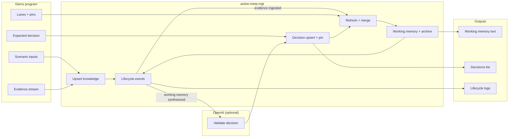

# Lifecycle + OpenAI Example

A TypeScript script that wires `active-meta-mgt` lifecycle hooks into a diagnostic
runbook with a known correct decision, then calls the OpenAI SDK when working memory
is synthesized. It demonstrates:

- Custom lanes and selection policies
- Pinning and lane status changes
- Event-driven synthesis triggered by `evidence:ingested`
- Multiple OpenAI calls from separate lifecycle hooks
- Decision validation against a known correct answer
- A lifecycle hook that computes latency increase between two evidence items
- Separate LLM hooks for triage summary, stakeholder update, and risk assessment

## Prereqs

- `OPENAI_API_KEY` in your environment
- Install the OpenAI SDK in the repo root (this example imports the local source):

```bash
bun add openai
```

## Run

```bash
bun run examples/lifecycle-openai/main.ts
```

## How to Navigate This File (main.ts)

- Narrative overview: `examples/lifecycle-openai/main.ts:2`
- Types + basic helpers: `examples/lifecycle-openai/main.ts:41`
- Prompt builders: `examples/lifecycle-openai/main.ts:76`
- LLM request helpers: `examples/lifecycle-openai/main.ts:133`
- Lifecycle hooks wiring: `examples/lifecycle-openai/main.ts:289`
- Main demo flow: `examples/lifecycle-openai/main.ts:559`
- Entrypoint: `examples/lifecycle-openai/main.ts:752`

### Optional env

- `OPENAI_MODEL` (defaults to `gpt-5`)

If `OPENAI_API_KEY` is not set, the script will skip the OpenAI request, apply the
known decision directly, and still print the lifecycle stats.

## Flow (High Level)



## ASCII Overview

```
Scenario inputs + evidence
            |
            v
  +------------------------+
  | active-meta-mgt        |
  | - upsert knowledge     |
  | - lanes + pins         |
  | - refresh + merge      |
  | - working memory       |
  | - lifecycle hooks      |
  +------------------------+
            |
            v
  Hook: evidence ingested
     -> math on two items
            |
            v
  Hook: working memory synthesized
     -> optional LLM validates decision
     -> optional LLM writes update
            |
            v
  Decision upsert + pin
            |
            v
  Re-synthesize
            |
            v
  Outputs:
    - working memory text
    - decisions list
    - lifecycle stats/logs
```

~~~console
$ bun run main.ts
[2026-01-28T21:50:35.758Z] Booting diagnostic workflow.
[2026-01-28T21:50:35.763Z] Configuring lanes and policies.
[2026-01-28T21:50:35.764Z] event: lane:created lane=incident
[2026-01-28T21:50:35.766Z] event: lane:statusChanged lane=personal enabled->disabled
[2026-01-28T21:50:35.766Z] event: lane:statusChanged lane=legal enabled->muted
[2026-01-28T21:50:35.766Z] Upserting base knowledge objects.
[2026-01-28T21:50:35.767Z] event: knowledgeObject:upserted kind=goal id=g-restore isNew=true
[2026-01-28T21:50:35.767Z] event: knowledgeObject:upserted kind=constraint id=c-no-data-loss isNew=true
[2026-01-28T21:50:35.767Z] event: knowledgeObject:upserted kind=assumption id=a-deploy isNew=true
[2026-01-28T21:50:35.767Z] event: knowledgeObject:upserted kind=question id=q-scope isNew=true
[2026-01-28T21:50:35.768Z] event: lane:pinChanged lane=incident constraint:c-no-data-loss pinned=true
[2026-01-28T21:50:35.768Z] Pinned critical constraint; refreshing incident lane selection.
[2026-01-28T21:50:35.769Z] event: lane:refreshed lane=incident selected=4
[2026-01-28T21:50:35.769Z] Ingesting evidence e-1.
[2026-01-28T21:50:35.769Z] event: knowledgeObject:upserted kind=evidence id=e-1 isNew=true
[2026-01-28T21:50:35.771Z] event: lanes:refreshedAll lanes=6 totalSelected=6
[2026-01-28T21:50:35.771Z] event: activeWindow:merged merged=5 lanes=task,threat-model,implementation,incident
[2026-01-28T21:50:35.771Z] event: evidence:ingested evidenceId=e-1
[2026-01-28T21:50:35.771Z] Ingesting evidence e-latency-baseline.
[2026-01-28T21:50:35.772Z] event: knowledgeObject:upserted kind=evidence id=e-latency-baseline isNew=true
[2026-01-28T21:50:35.772Z] event: lanes:refreshedAll lanes=6 totalSelected=7
[2026-01-28T21:50:35.773Z] event: activeWindow:merged merged=6 lanes=task,threat-model,implementation,incident
[2026-01-28T21:50:35.773Z] OpenAI triage request start (model=gpt-5).
[2026-01-28T21:50:35.773Z] event: evidence:ingested evidenceId=e-latency-baseline
[2026-01-28T21:50:35.773Z] Ingesting evidence e-latency-peak.
[2026-01-28T21:50:35.774Z] event: knowledgeObject:upserted kind=evidence id=e-latency-peak isNew=true
[2026-01-28T21:50:35.774Z] event: lanes:refreshedAll lanes=6 totalSelected=8
[2026-01-28T21:50:35.774Z] event: activeWindow:merged merged=7 lanes=task,threat-model,implementation,incident
[2026-01-28T21:50:35.774Z] Calculated latency increase: 1052% (baseline 213ms → peak 2453ms).
[2026-01-28T21:50:35.774Z] event: evidence:ingested evidenceId=e-latency-peak
[2026-01-28T21:50:35.775Z] Ingesting evidence e-4.
[2026-01-28T21:50:35.776Z] event: knowledgeObject:upserted kind=evidence id=e-4 isNew=true
[2026-01-28T21:50:35.776Z] event: lanes:refreshedAll lanes=6 totalSelected=9
[2026-01-28T21:50:35.777Z] event: activeWindow:merged merged=8 lanes=task,threat-model,implementation,incident
[2026-01-28T21:50:35.777Z] Evidence threshold reached; triggering synthesis.
[2026-01-28T21:50:35.778Z] event: lanes:refreshedAll lanes=6 totalSelected=9
[2026-01-28T21:50:35.778Z] event: activeWindow:merged merged=8 lanes=task,threat-model,implementation,incident
[2026-01-28T21:50:35.779Z] event: archive:created archiveId=arch_1769637035779_d7cc91aa2b0ea
[2026-01-28T21:50:35.779Z] OpenAI request start (model=gpt-5).
[2026-01-28T21:50:35.779Z] event: workingMemory:synthesized tokens=131/520
[2026-01-28T21:50:35.779Z] event: evidence:ingested evidenceId=e-4
[2026-01-28T21:50:35.779Z] Awaiting OpenAI validation.
[2026-01-28T21:50:38.695Z] OpenAI request complete.
[2026-01-28T21:50:38.695Z] OpenAI output matched the expected decision.
[2026-01-28T21:50:38.695Z] event: knowledgeObject:upserted kind=decision id=d-llm-1769637038695 isNew=true
[2026-01-28T21:50:38.696Z] event: lane:pinChanged lane=incident decision:d-llm-1769637038695 pinned=true
[2026-01-28T21:50:38.696Z] event: lanes:refreshedAll lanes=6 totalSelected=10
[2026-01-28T21:50:38.697Z] OpenAI risk request start (model=gpt-5).
[2026-01-28T21:50:38.697Z] event: activeWindow:merged merged=9 lanes=task,threat-model,implementation,incident
[2026-01-28T21:50:38.697Z] event: archive:created archiveId=arch_1769637038697_283ce458f07f38
[2026-01-28T21:50:38.697Z] OpenAI update request start (model=gpt-5).
[2026-01-28T21:50:38.697Z] event: workingMemory:synthesized tokens=156/520
[2026-01-28T21:50:42.253Z] OpenAI triage request complete.
[2026-01-28T21:50:42.253Z] LLM triage summary: After deploy 91a7, checkout error rate spiked to 18% (pre-deploy p95 latency 213 ms), indicating a likely regression. Goal: restore checkout within 30 minutes without dropping/duplicating orders, while confirming if the issue is isolated to the checkout service.
[2026-01-28T21:51:00.580Z] OpenAI update request complete.
[2026-01-28T21:51:00.580Z] LLM stakeholder update: We’re seeing checkout slowdowns and errors after a recent update; we’ve disabled the new promo banner and are rolling back the update to restore normal service within 30 minutes, with no orders lost or duplicated.
[2026-01-28T21:51:04.251Z] OpenAI risk request complete.
[2026-01-28T21:51:04.252Z] LLM risk assessment: Critical operational risk with high likelihood and severe impact due to checkout degradation (p95 2453ms, 18% errors) likely tied to deploy 91a7/promo-banner cache misses; urgent rollback and flag disablement required to meet the 30-minute target without order loss/duplication, with blast radius beyond checkout still uncertain.
[2026-01-28T21:51:04.252Z] Final payload ready; printing summary.
---- WORKING MEMORY ----

Goals:
- Restore checkout availability within 30 minutes

Constraints:
- Mitigation must not drop or duplicate orders

Decisions:
- Disable the promo-banner feature flag and roll back deploy 91a7 to stabilize checkout.

Evidence:
- Peak checkout latency p95 observed at 2453ms after deploy 91a7
- Baseline checkout latency p95 measured at 213ms before deploy 91a7
- Error rate spiked to 18% immediately after deploy 91a7
- Promo-banner feature flag rollout correlates with spike in cache misses

Assumptions:
- A recent deployment introduced the regression

Open questions:
- Is the outage isolated to the checkout service?

---- DECISIONS ----

- Disable the promo-banner feature flag and roll back deploy 91a7 to stabilize checkout.

---- LIFECYCLE STATS ----

events: 35
evidence ingested: 4
by kind: {"goal":1,"constraint":1,"assumption":1,"question":1,"evidence":4,"decision":1}
by type: {"lane:created":1,"lane:statusChanged":2,"knowledgeObject:upserted":9,"lane:pinChanged":2,"lane:refreshed":1,"lanes:refreshedAll":6,"activeWindow:merged":6,"evidence:ingested":4,"archive:created":2,"workingMemory:synthesized":2}
lane status changes: personal:enabled->disabled, legal:enabled->muted
pin changes: incident:constraint:c-no-data-loss:pinned, incident:decision:d-llm-1769637038695:pinned
last archive id: arch_1769637038697_283ce458f07f38
tokens: budget=520, actual=156
latency increase: 1052%
triage summary: After deploy 91a7, checkout error rate spiked to 18% (pre-deploy p95 latency 213 ms), indicating a likely regression. Goal: restore checkout within 30 minutes without dropping/duplicating orders, while confirming if the issue is isolated to the checkout service.
stakeholder update: We’re seeing checkout slowdowns and errors after a recent update; we’ve disabled the new promo banner and are rolling back the update to restore normal service within 30 minutes, with no orders lost or duplicated.
risk assessment: Critical operational risk with high likelihood and severe impact due to checkout degradation (p95 2453ms, 18% errors) likely tied to deploy 91a7/promo-banner cache misses; urgent rollback and flag disablement required to meet the 30-minute target without order loss/duplication, with blast radius beyond checkout still uncertain.
expected latency increase: 1052%
expected decision: Disable the promo-banner feature flag and roll back deploy 91a7 to stabilize checkout.
~~~
